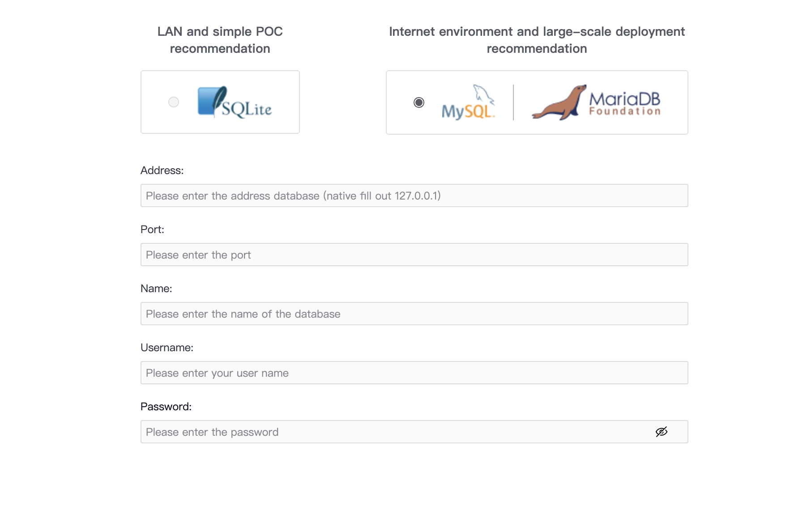
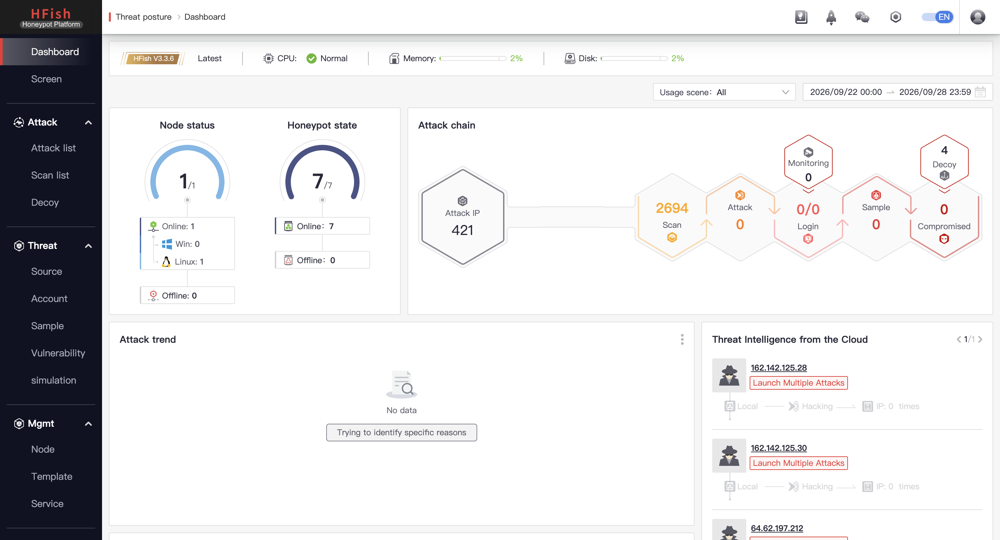
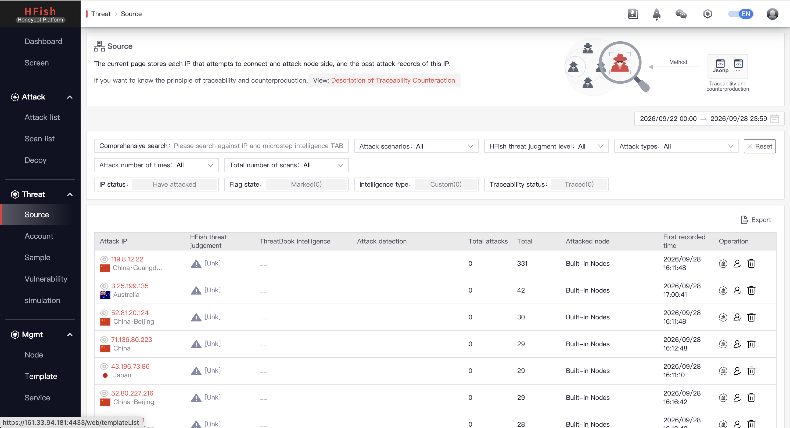

# Setup HFish HoneyPot
___
## 项目简介
  - 基于 OCI 的云蜜罐实验环境
  - 使用 HFish 收集互联网攻击流量
  - 分析自动化扫描、爆破、恶意连接行为
  - 学习云安全与主机加固
___
## 项目目的
 - 学习搭建蜜罐
 - 观察真实互联网攻击
 - 研究攻击者行为
 - 为未来的IDS做流量收集
 - 用家里机器怕被打穿+运行商封号
___
## 为何选择HFish
  ### 常见蜜罐方案对比
    | 方案         | 原因                    |
    | ---------- | ------------------       |
    | HFish      | 轻量、中文生态好、支持多协议  |
    | Cowrie     | SSH/Telnet 强，但功能单一   |
    | T-Pot      | 太重，OCI 免费机型可能跑不动  |
    | Dionaea    | 偏恶意软件收集              |
    | OpenCanary | 更适合轻量告警              |
  ### 选择HFish原因：
    - 我关注的B站UP·主网络小白_Uncle城·用它
    - 支持协议全面
    - 有中文教程，适合入门
    - 未来会考虑增加或更换蜜罐
___
## 结构
```text
  Internet
     ↓
  OCI Public IP
     ↓
  VCN
     ↓
  Public Subnet
     ↓
  Ubuntu
     ├── HFish
     │     
     └── UFW/iptables
```
---
## 过程
### 1. 在本实例所在的 Oracle Virtual Cloud Network 放行 4433 端口
```
Source Type: CIDR
Source CIDR: 我的公网络IP/32
IP Protocol: TCP
Source Port Range: 留空
Destination Port Range: 4433
Description: HFish Management
```

### 2. 操作系统开放 4433 端口作为管理页面

进入iptable在INPUT REJECT之前添加一条ACCEPT 4433
```
sudo nano /etc/iptables/rules.v4
```
```
-A INPUT -p tcp -m state --state NEW -m tcp --dport 22 -j ACCEPT
-A INPUT -p tcp -m state --state NEW -m tcp --dport 4433 -j ACCEPT
-A INPUT -j REJECT --reject-with icmp-host-prohibited
```
### 3. 关闭 111 端口以减少暴露面

https://docs.oracle.com/en-us/iaas/Content/File/Troubleshooting/check-mt-network-rpcinfo.htm
根据甲骨文官方的说明，该端口适用于 OCI File Storage / NFS Mount Target 的连通性检查。我的服务器没有挂载 OCI File Storge，因此可以关闭该端口和 `rpcbind` 进程。

关闭进程：
```
sudo systemctl disable --now rpcbind.socket rpcbind.service
```
检查：
```
ss -lntup
```

### 4.根据教程安装 `HFish`

教程链接：https://github.com/hacklcx/HFish/blob/master/docs/2-2-linux.md

#### 4.1 `wget` 下载安装包

下载 `wget`:
```
sudo apt update

sudo apt install -y wget
```

#### 4.2 下载安装包

```
wget https://hfish.cn-bj.ufileos.com/hfish-3.3.6-linux-arm64.tgz
```

#### 4.3 解压+安装

创建文件夹并解压到该文件夹：
```
mkdir -p ~/hfish
tar -xzf ~/hfish-3.3.6-linux-arm64.tgz -C ~/hfish
```

检查：
```
cd ~/hfish
ls -lah
```

安装：
```
sudo ./install.sh
```

输出：
```
install hfish success!
find mail check: []
./install.sh: 36: source: not found         ← install.sh 里用了 Bash 的 source，但脚本实际被 /bin/sh 执行了。不影响主程序启动。
unset mail check!
get now crontab list
./install.sh: 41: crontab: not found        ← 依赖的 cron 没有安装，所以脚本没有写入成功
./install.sh: 45: crontab: not found
task no exists, add task ok
start hfish daemon ok!                      ← HFish守护进程已开启
install hfish finished!
```

#### 4.4 安装依赖的 cron

`cron` 是 Linux 里的定时任务服务，让服务器在指定时间自动执行某个命令或脚本。HFish需要 `cron` 来每分钟执行一次 HFish 的主程序路径 $bin_path。（如果 HFish 进程挂掉，下一分钟 cron 又会尝试拉起它）

安装并启动：
```
sudo apt install -y cron

sudo systemctl enable --now cron
```

PS: 脚本实际是用 sh 跑的，而 Ubuntu 的 /bin/sh 通常是 dash，dash 没有 source 命令。等价写法应该是 . $pro_file

#### 4.5 配置 crontab

查看 crontab 定时任务表：`sudo crontab -l`

编辑 crontab 定时任务表: `sudo crontab -e`: 最后一行添加:`* * * * * /home/ubuntu/hfish/hfish`
前五个点表示：
```
分钟  小时  日  月  星期
 *     *    *   *    *
```
意思是每分钟执行一次这个脚本：`/home/ubuntu/hfish/hfish`

确认 cron 服务状态（确保显示active)：
```
systemctl status cron --no-pager
```

#### 4.6 查看蜜罐服务需要监听的端口
输入：
```
sudo ss -lntup | grep -E 'hfish|LISTEN'
```
输出：
```
tcp   LISTEN 0      4096          127.0.0.54:53        0.0.0.0:*    users:(("systemd-resolve",pid=686703,fd=17))             
tcp   LISTEN 0      4096       127.0.0.53%lo:53        0.0.0.0:*    users:(("systemd-resolve",pid=686703,fd=15))             
tcp   LISTEN 0      4096             0.0.0.0:22        0.0.0.0:*    users:(("sshd",pid=936023,fd=3),("systemd",pid=1,fd=198))
tcp   LISTEN 0      4096                   *:9000            *:*    users:(("hfish-server",pid=1157234,fd=22))               
tcp   LISTEN 0      4096                   *:9200            *:*    users:(("hfish-server",pid=1157234,fd=20))               
tcp   LISTEN 0      4096                   *:6379            *:*    users:(("hfish-server",pid=1157234,fd=21))               
tcp   LISTEN 0      4096                   *:8080            *:*    users:(("hfish-server",pid=1157234,fd=23))               
tcp   LISTEN 0      4096                   *:8081            *:*    users:(("hfish-server",pid=1157234,fd=17))               
tcp   LISTEN 0      4096                   *:7879            *:*    users:(("hfish-server",pid=1157234,fd=27))               
tcp   LISTEN 0      4096                   *:4433            *:*    users:(("hfish-server",pid=1157234,fd=15))               
tcp   LISTEN 0      4096                   *:4434            *:*    users:(("hfish-server",pid=1157234,fd=13))               
tcp   LISTEN 0      4096                   *:3389            *:*    users:(("hfish-server",pid=1157234,fd=29))               
tcp   LISTEN 0      4096                   *:445             *:*    users:(("hfish-server",pid=1157234,fd=28))               
tcp   LISTEN 0      4096                   *:80              *:*    users:(("hfish-server",pid=1157234,fd=19))               
tcp   LISTEN 0      4096                [::]:22           [::]:*    users:(("sshd",pid=936023,fd=4),("systemd",pid=1,fd=199))
tcp   LISTEN 0      4096                   *:135             *:*    users:(("hfish-server",pid=1157234,fd=25))               
tcp   LISTEN 0      4096                   *:139             *:*    users:(("hfish-server",pid=1157234,fd=26))               
tcp   LISTEN 0      4096                   *:1433            *:*    users:(("hfish-server",pid=1157234,fd=24))
```
总结：
```
80
135
139
445
1433
3389
6379
7879
8080
8081
9000
9200
4433        ← HFish Web 管理页面（只开放给管理员）
4434        ← 节点数据回传端口
```

### 5. 进入管理后台

https://[服务器公网IP]:4433/web/login

选择 SQLite 作为数据库


进入后页面如下：



记得换默认登陆密码

---
## 技术栈
  - Oracle Cloud Infrastructure (OCI)
  - Ubuntu Server 24
  - Docker / Docker Compose
  - HFish
  - UFW / iptables

---
实用运维命令

查看监听的端口：
```
sudo ss -lntup
```
